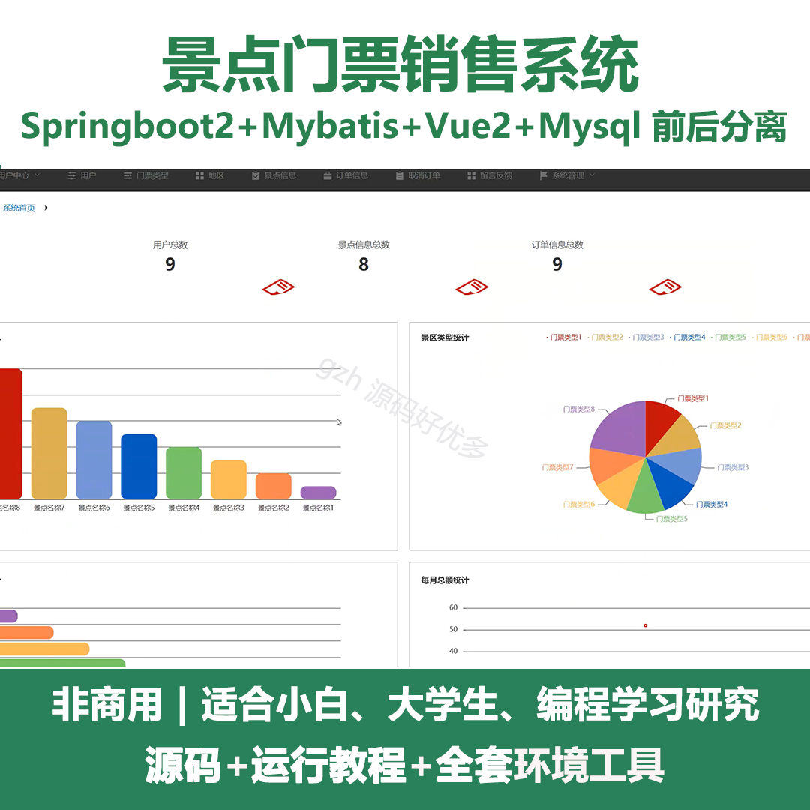
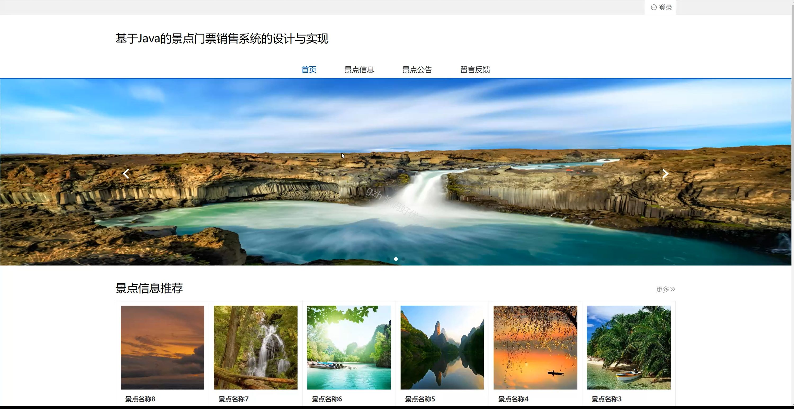
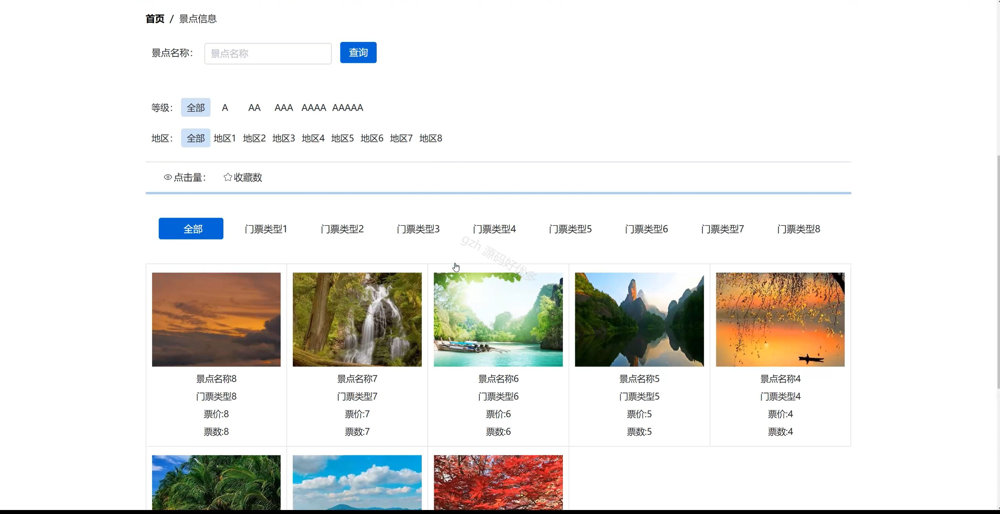
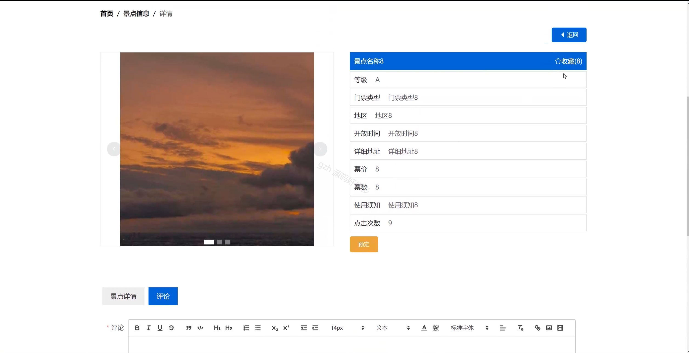
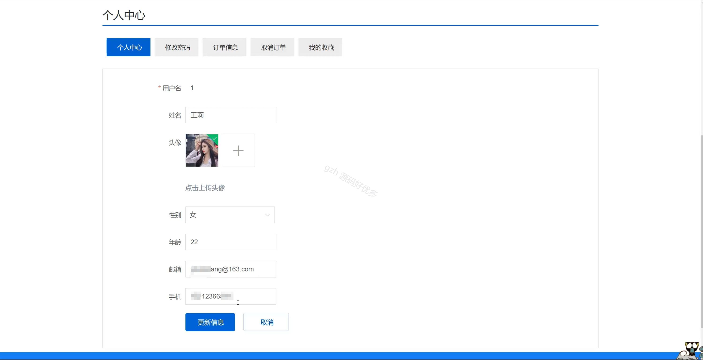
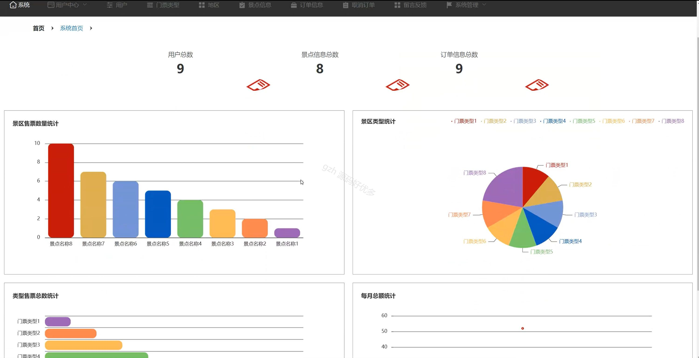
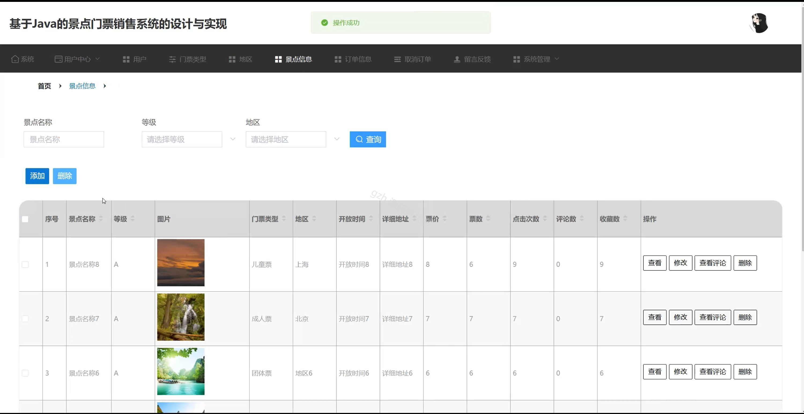
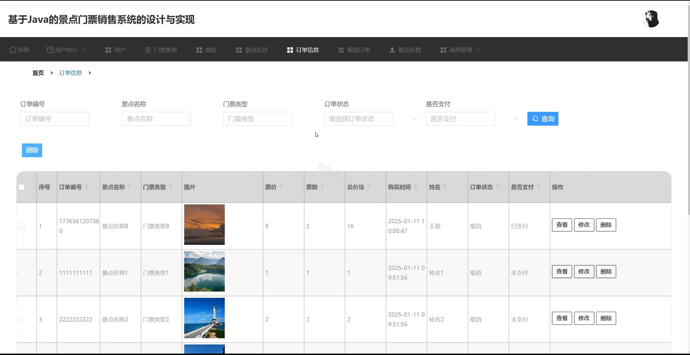
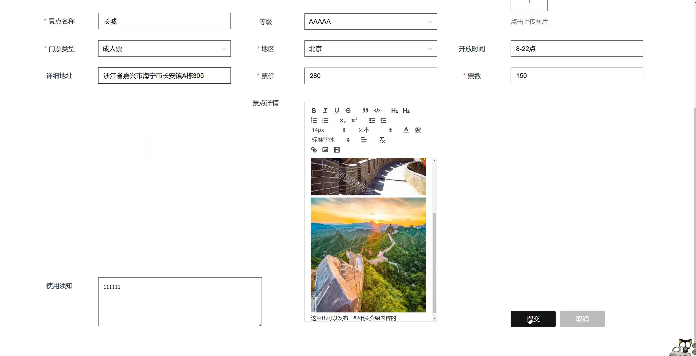

# springbootA248D
springbootA248D景点门票销售系统
 
## 查看主页获取源码

### 一、关键词
景点信息、门票销售、门票订单

### 二、作品包含
源码+数据库+全套环境和工具资源+本地部署教程

### 三、项目技术
前端技术：Html、Css、Js、Vue2.0、Element-ui 
后端技术：Java、SpringBoot2.0、MyBatis

### 四、运行环境（以下版本亲测，其他版本未知，请自测）
开发工具：IDEA/eclipse  + VSCODE

数据库：MySQL5.7（最低要5.7版本）

数据库管理工具：Navicat10以上版本

环境配置软件： JDK1.8 + Maven3.6.3

前端Nodejs：14

浏览器：谷歌浏览器

### 五、项目介绍
项目编号：springbootA248D

景点门票销售系统可实现门票销售等功能，助力景点高效管理并为游客提供便捷购票体验。

角色：管理员、用户

管理员：系统、用户中心、用户、门票类型、地区、景点信息、订单信息、取消订单、留言反馈、系统管理。

用户：首页、景点信息、景点公告、留言反馈、个人中心、修改密码、订单信息、取消订单、我的收藏。

### 六、运行截图

